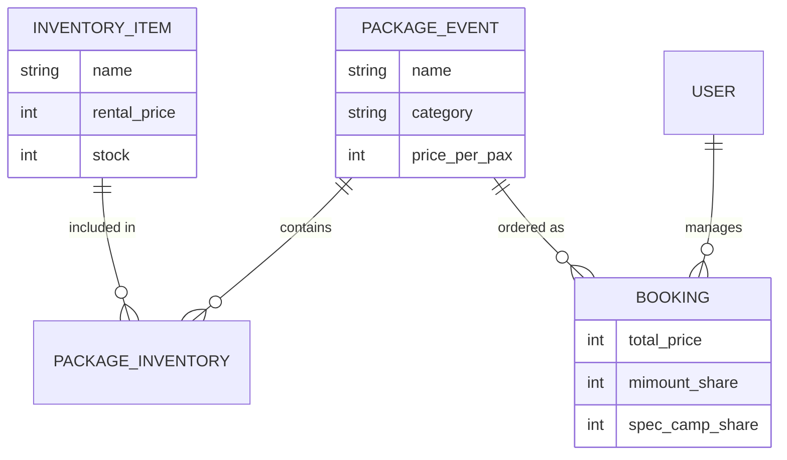

# Dokumentasi Aplikasi & Alur Bisnis Spec Camp

Aplikasi ini dirancang untuk mengelola operasional camping ground **Spec Camp** bekerja sama dengan **Mimount Outdoor** sebagai penyedia peralatan dan mitra pengelola.

---

## 1. Model Bisnis (Revenue Share)

Sistem keuangan Spec Camp didasarkan pada pembagian hasil antara dua entitas utama:

*   **Spec Camp**: Pemilik lahan dan pengelola fasilitas utama.
*   **Mimount Outdoor**: Supplier peralatan camping (Inventory) dan mitra operasional.

### Aturan Pembagian Hasil:
1.  **Penyewaan Alat (Inventory)**: 100% pendapatan dari item inventory murni diberikan kepada **Mimount Outdoor**.
2.  **Layanan & Tiket (Net Revenue)**: Pendapatan dari Tiket Masuk, Jasa Tracking, dan Paket Event (setelah dikurangi biaya alat) dibagi dengan rasio:
    *   **70%** untuk Spec Camp.
    *   **30%** untuk Mimount Outdoor.

---

## 2. Struktur Data & Hubungan

---

## 3. Alur Operasional (Flow Bisnis)

### A. Manajemen Inventory (Mimount)
1.  Mimount Outdoor mendaftarkan semua peralatan (tenda, matras, lampu, dll) ke dalam sistem.
2.  Setiap alat memiliki "Harga Sewa Internal" yang menjadi acuan perhitungan bagi hasil.

### B. Pembuatan Paket (Package Events)
1.  Admin membuat paket (contoh: Paket Gathering).
2.  Admin menentukan harga jual ke konsumen (misal: Rp 250.000/pax).
3.  Admin memilih alat Mimount apa saja yang disertakan dalam paket tersebut.
4.  Sistem secara otomatis menghitung estimasi bagi hasil berdasarkan harga paket dan biaya alat yang disertakan.

### C. Proses Booking & Transaksi
1.  Pelanggan memilih paket (melalui Landing Page atau Admin).
2.  Sistem menghitung total porsi pendapatan:
    *   **Porsi Alat** = Total Harga Sewa Alat dalam paket.
    *   **Sisa Pendapatan** = Harga Jual - Porsi Alat.
    *   **Spec Camp Share** = Sisa Pendapatan × 70%.
    *   **Mimount Share** = Porsi Alat + (Sisa Pendapatan × 30%).

---

## 4. Kategori Paket

Aplikasi membagi layanan menjadi 4 kategori utama:
1.  **Area & Camping**: Sewa lahan dan camping reguler.
2.  **Event / Gathering**: Paket rombongan besar dengan fasilitas lengkap.
3.  **Tiket Masuk**: Untuk pengunjung harian atau yang membawa alat sendiri.
4.  **Tracking**: Layanan jasa pemandu wisata alam.

---

## 5. Panduan Teknis Singkat

*   **Frontend**: Vue 3 dengan Vite. Menggunakan alias `@` untuk semua import komponen.
*   **Backend**: Node.js dengan Sequelize ORM.
*   **Database**: MySQL dengan tabel utama `inventory_items`, `package_events`, dan `package_inventories`.
*   **Keamanan**: Autentikasi berbasis JWT dengan Role-Based Access Control (RBAC).

---

**Dokumentasi ini dibuat sebagai acuan pengembangan sistem Spec Camp Management.**
