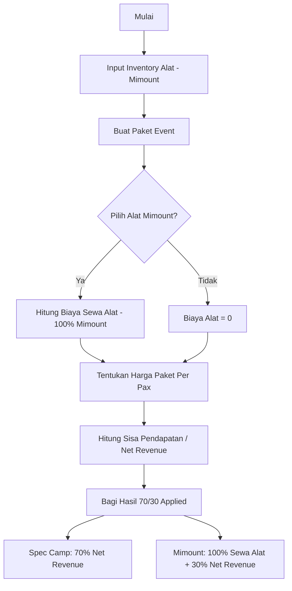

# Alur Bisnis Spec Camp & Mimount Outdoor

Dokumen ini menjelaskan logika finansial dan alur kerja aplikasi Spec Camp.

## 1. Flowchart Bisnis

## 2. Logika Perhitungan (Formula)

Sistem menggunakan formula berikut untuk setiap transaksi:

$$Total = Harga Paket \times Pax$$
$$PorsiAlat = \sum (HargaSewaItem \times Qty)$$
$$NetRevenue = Total - PorsiAlat$$

**Pembagian Akhir:**
*   **Spec Camp** = $NetRevenue \times 0.7$
*   **Mimount** = $PorsiAlat + (NetRevenue \times 0.3)$

## 3. Alur Pengguna (User Flow)

### Peran Admin:
1.  **Login**: Masuk ke Dashboard.
2.  **Manajemen Inventory**: Menambah/Update stok alat dari Mimount Outdoor.
3.  **Manajemen Paket**: Membuat paket camping atau event. Menghubungkan paket dengan alat yang diperlukan.
4.  **Monitoring**: Melihat performa penjualan dan laporan bagi hasil (Fitur selanjutnya).

### Peran Pelanggan (Halaman Depan):
1.  **Cek Informasi**: Melihat daftar paket di Landing Page.
2.  **Booking**: Memilih paket dan tanggal (Fitur selanjutnya).
3.  **Konfirmasi**: Menerima rincian biaya.

## 4. Keunggulan Sistem

*   **Transparansi**: Kedua belah pihak (Spec Camp & Mimount) memiliki visibilitas yang sama terhadap porsi pendapatan masing-masing.
*   **Otomatisasi**: Admin tidak perlu menghitung manual bagi hasil setiap kali ada perubahan harga alat atau paket.
*   **Modular**: Memisahkan pengelolaan alat (Inventory) dengan pengelolaan produk (Paket).
